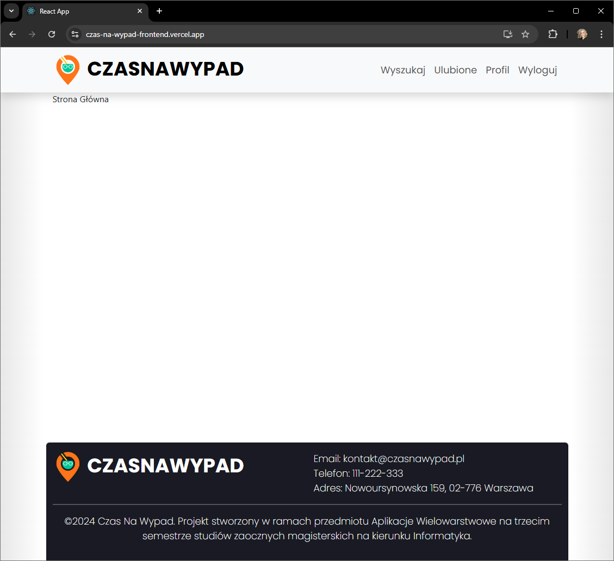
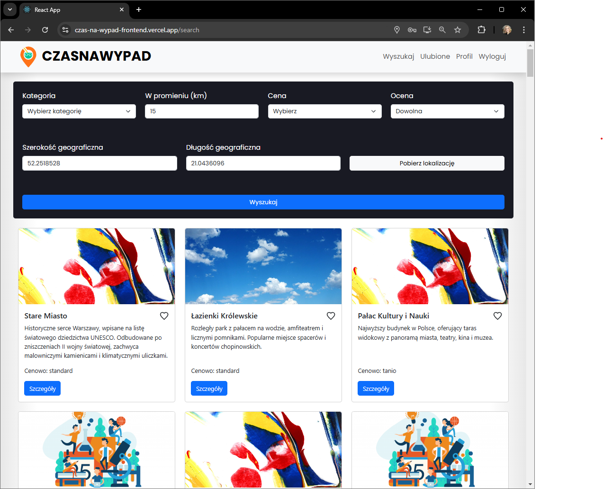
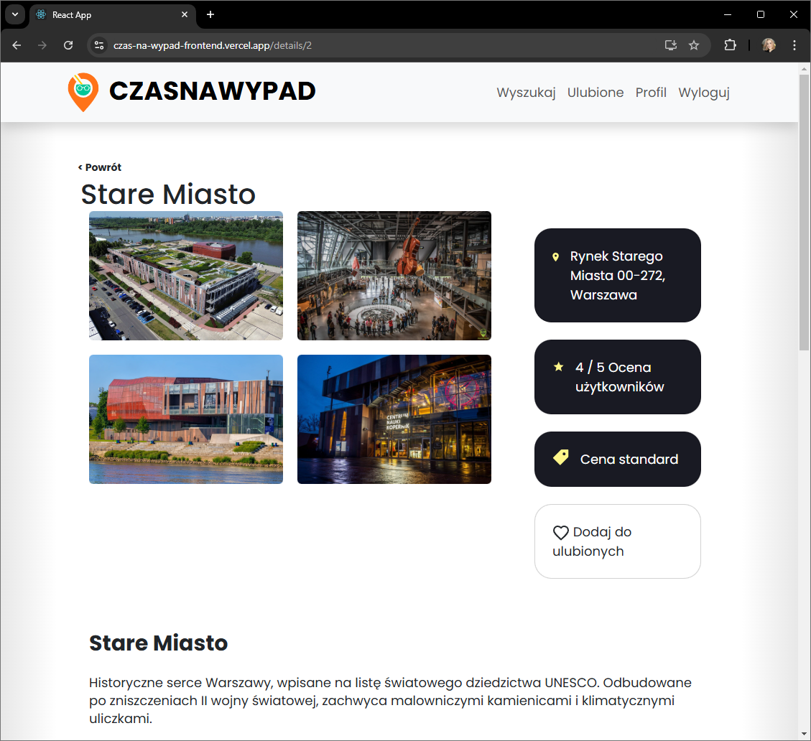
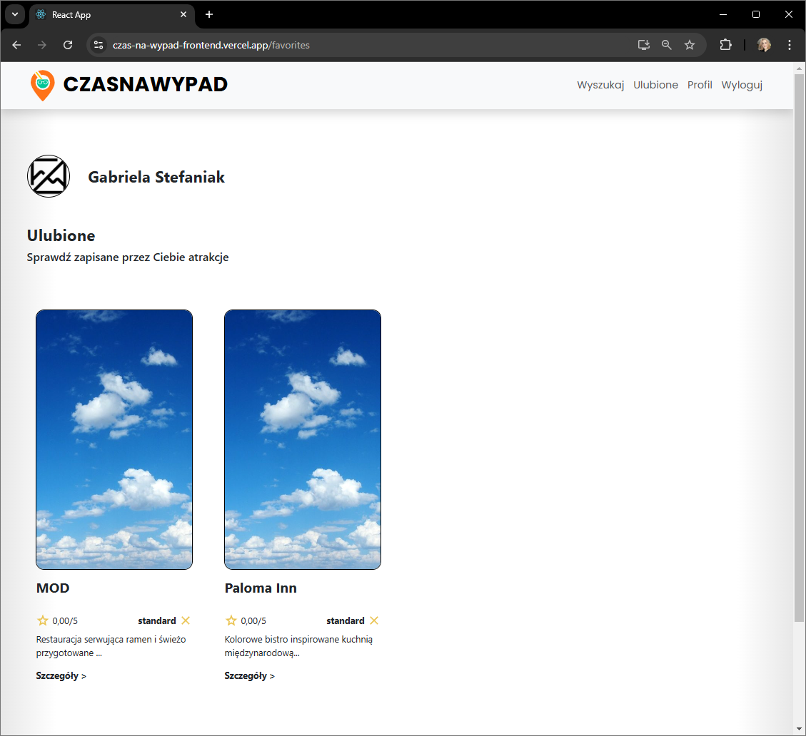
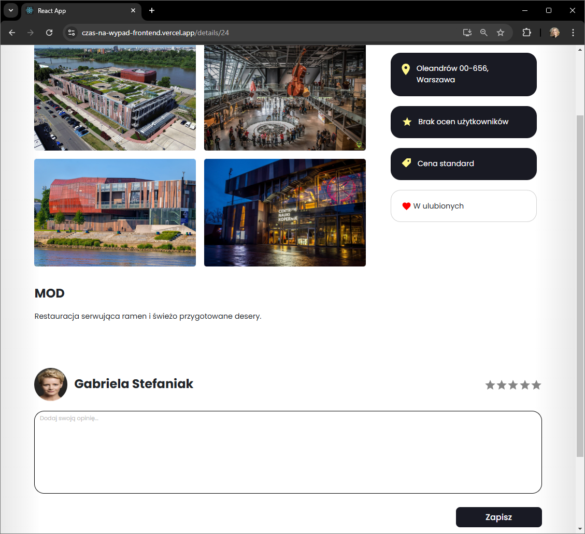
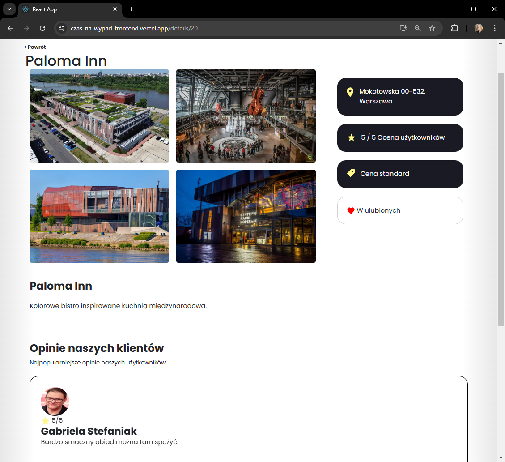

# Wygląd wystawionej aplikacji

## Strona rejestracji:

## Strona logowania:

## Strona główna:

## Strona wyszukiwania (wyszukiwarka atrakcji):

## Strona szczegółów atrakcji:

## Strona ulubionych użytkownika:

## Strona dodawania ocen wraz z komentarzami:

## Strona ocen atrakcji:
