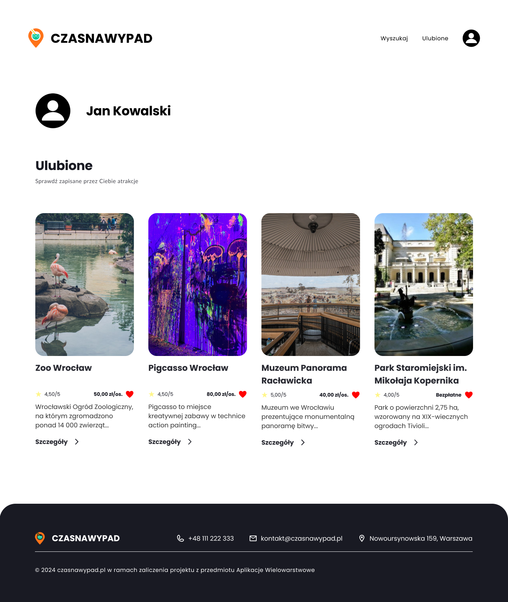
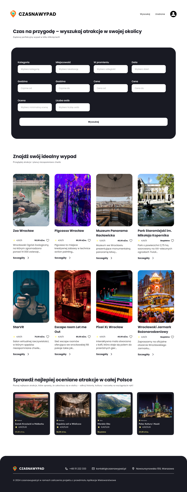

# Dokumentacja Makiet

Poniższy dokument zawiera opis trzech makiet interfejsu użytkownika: **szczegóły atrakcji**, **ulubione atrakcje** oraz **wyszukiwarka atrakcji**.

---

## 1. Strona Szczegółów Atrakcji

Strona szczegółów atrakcji prezentuje informacje o wybranym miejscu turystycznym. Jej najważniejsze elementy to:
- **Galeria zdjęć** – pokazuje cztery zdjęcia atrakcji.
- **Informacje o lokalizacji** – adres, ocena użytkowników, zakres cenowy.
- **Opis atrakcji** – zawiera szczegółowe informacje o historii i aktywnościach, takich jak warsztaty, Planetarium itp.
- **Opinie użytkowników** – sekcja przedstawiająca opinie oraz pole do dodania nowej opinii wraz z oceną w gwiazdkach.
- **Stopka** – dane kontaktowe i informacje prawne.

---

## 2. Strona Ulubionych Atrakcji

Strona ulubionych atrakcji umożliwia przechowywanie i przeglądanie zapisanych przez użytkownika miejsc. Zawiera:
- **Lista ulubionych atrakcji** – każdy kafelek zawiera:
  - Zdjęcie atrakcji.
  - Krótki opis miejsca.
  - Cenę (np. 50,00 zł/os. lub "Bezpłatne").
  - Ocenę w gwiazdkach.
  - Przycisk "Szczegóły" prowadzi do strony szczegółów danej atrakcji.
- **Stopka** – dane kontaktowe i informacje prawne.

---

## 3. Strona Wyszukiwarki Atrakcji

Strona wyszukiwarki atrakcji umożliwia filtrowanie i znajdowanie miejsc w zależności od preferencji użytkownika. Główne funkcjonalności:
- **Panel wyszukiwania** – zawiera pola do filtrowania według kategorii, lokalizacji, promienia, daty, godzin otwarcia, ceny, oceny oraz liczby osób.
- **Lista wyników wyszukiwania** – każdy kafelek zawiera:
  - Zdjęcie atrakcji.
  - Krótki opis miejsca.
  - Cenę.
  - Ocenę w gwiazdkach.
  - Przycisk "Szczegóły" prowadzi do strony szczegółów danej atrakcji.
- **Sekcja "Najlepiej oceniane atrakcje w całej Polsce"** – przedstawia polecane atrakcje z wysokimi ocenami.
- **Stopka** – dane kontaktowe i informacje prawne.

---

## Układ Makiet

Makiety są logicznie połączone w następującym układzie:
1. **Strona Wyszukiwarki Atrakcji** – jako punkt wejścia do aplikacji.
2. **Strona Szczegółów Atrakcji** – dostępna po kliknięciu przycisku "Szczegóły" w wynikach wyszukiwania lub z listy ulubionych.
3. **Strona Ulubionych Atrakcji** – dostępna z menu profilu użytkownika.
