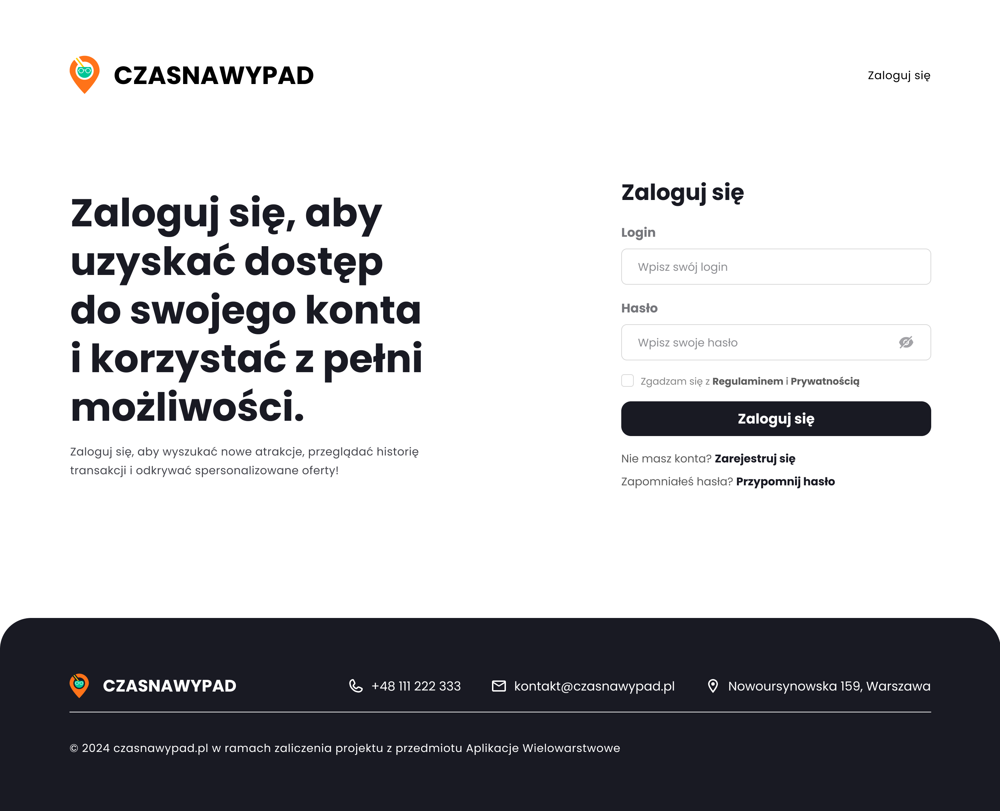

# Dokumentacja Makiet

Poniższy dokument zawiera opis trzech kluczowych makiet interfejsu użytkownika: **logowanie**, **rejestracja** oraz **przypomnienie hasła**.

---

## 1. Ekran Logowania

Ekran logowania umożliwia użytkownikowi dostęp do swojego konta. Jego najważniejsze elementy to:
- **Pole na login** – użytkownik wprowadza swoją nazwę użytkownika lub e-mail.
- **Pole na hasło** – umożliwia wpisanie hasła.
- **Checkbox** – akceptacja regulaminu oraz polityki prywatności.
- **Przycisk "Zaloguj się"** – inicjuje proces logowania.
- **Opcje dodatkowe**:
  - Link do rejestracji w przypadku braku konta.
  - Link do przypomnienia hasła w przypadku jego zapomnienia.

---

## 2. Ekran Rejestracji

Ekran rejestracji umożliwia nowym użytkownikom utworzenie konta. Zawiera:
- **Pole na imię i nazwisko** – opcjonalne dane do personalizacji konta.
- **Pole na login** – unikalny identyfikator użytkownika.
- **Pole na adres e-mail** – wymagane do potwierdzenia rejestracji.
- **Pole na hasło** – ustalenie zabezpieczeń konta.
- **Checkbox** – akceptacja regulaminu i polityki prywatności.
- **Przycisk "Zarejestruj się"** – kończy proces rejestracji.
- **Link do logowania** – w przypadku, gdy użytkownik posiada już konto.

---

## 3. Ekran Przypomnienia Hasła

Ten ekran pozwala użytkownikom odzyskać dostęp do konta w przypadku zapomnienia hasła. Główne funkcjonalności:
- **Pole na login** – użytkownik wpisuje swoją nazwę użytkownika lub e-mail.
- **Checkbox** – akceptacja regulaminu i polityki prywatności.
- **Przycisk "Potwierdź"** – wysyła link do zresetowania hasła.
- **Link do logowania** – umożliwia powrót do ekranu logowania.

---

## Układ Makiet

Makiety są logicznie połączone w następującym układzie:
1. **Ekran Logowania** – jako główny punkt wejścia.
2. **Ekran Rejestracji** – dostępny z ekranu logowania.
3. **Ekran Przypomnienia Hasła** – dostępny z ekranu logowania.

Układ wspiera przejrzystość oraz umożliwia użytkownikom łatwe poruszanie się pomiędzy funkcjonalnościami aplikacji.

---

## Dodatkowe Uwagi

- Wszystkie makiety mają spójny styl graficzny i wykorzystują te same elementy brandingowe, takie jak logo i stopka z informacjami kontaktowymi.
- Projektowanie zorientowane na użytkownika (UX) zapewnia intuicyjną obsługę aplikacji.
