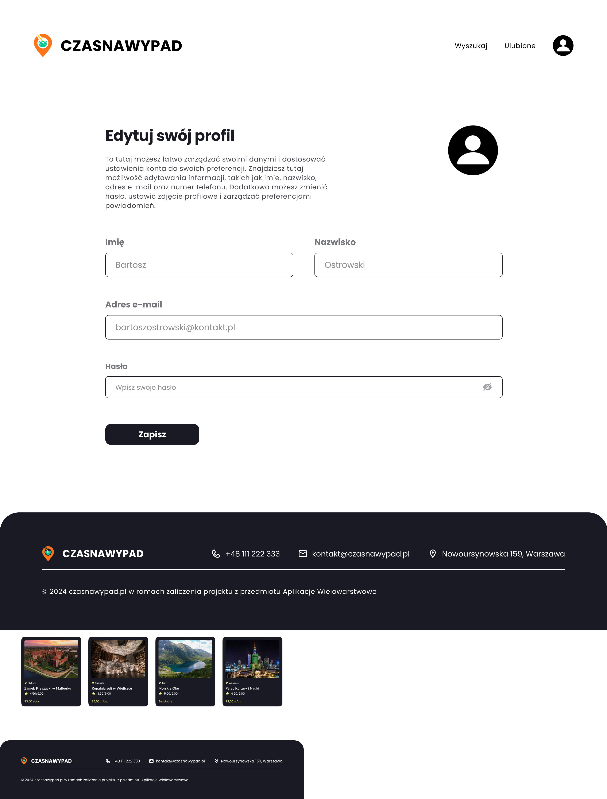
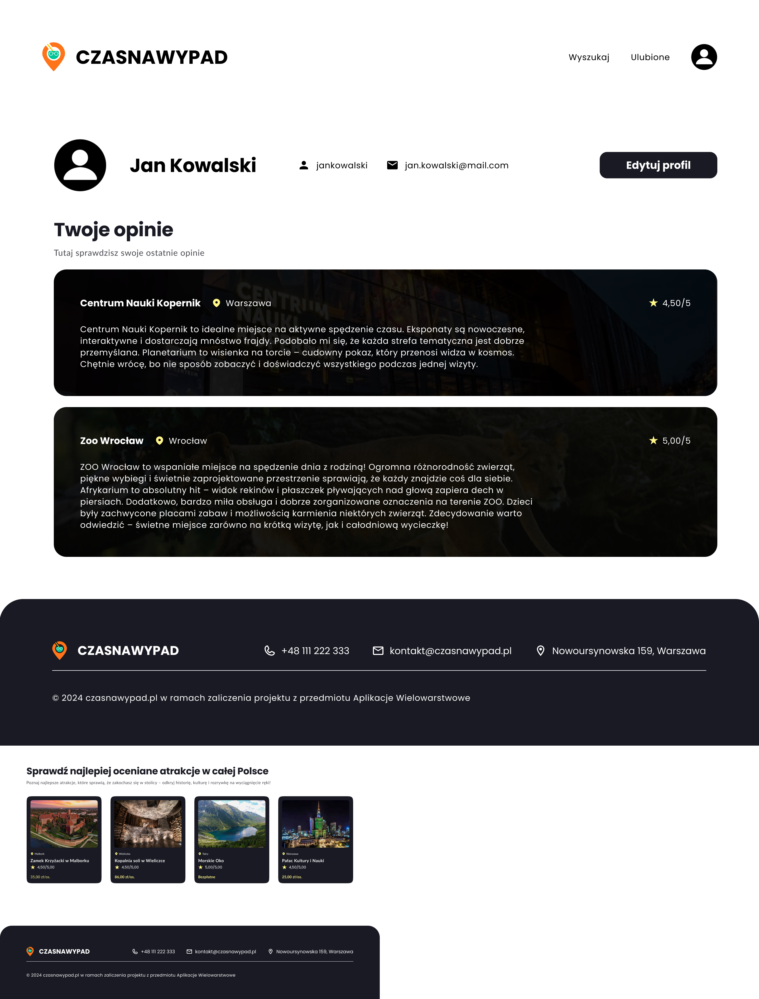

# Dokumentacja Makiet Profilu

Poniższy dokument zawiera opis dwóch kluczowych ekranów aplikacji związanych z zarządzaniem profilem użytkownika: **edycja profilu** oraz **profil użytkownika**.

---

## 1. Strona Edycji Profilu

Strona edycji profilu pozwala na zarządzanie danymi użytkownika oraz dostosowanie ustawień konta. Główne elementy:
- **Formularz edycji danych osobowych**:
  - Imię.
  - Nazwisko.
  - Adres e-mail.
  - Hasło.
- **Przycisk "Zapisz"** – zapisuje wprowadzone zmiany.
- **Stopka** – dane kontaktowe i informacje prawne.

---

## 2. Strona Profilu Użytkownika

Strona profilu użytkownika umożliwia przegląd danych konta oraz ocenionych atrakcji. Główne elementy:
- **Nagłówek profilu** – zawiera:
  - Nazwę użytkownika.
  - Adres e-mail.
  - Przycisk "Edytuj profil".
- **Lista ocenionych atrakcji** – każdy kafelek zawiera:
  - Nazwę atrakcji.
  - Lokalizację.
  - Opinię użytkownika.
  - Ocenę w gwiazdkach.
- **Sekcja "Najlepiej oceniane atrakcje w całej Polsce"** – przedstawia polecane atrakcje z wysokimi ocenami.
- **Stopka** – dane kontaktowe i informacje prawne.
